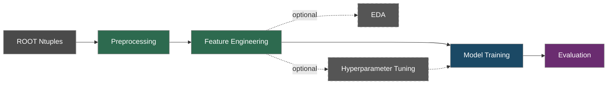

# Tau Anomaly Detection

[](#ci)
[](https://www.python.org/)
[](https://hydra.cc/)
[](https://wandb.ai/)
[](https://lightning.ai/)
[](https://docs.astral.sh/uv/)

Anomaly-based supersymmetry search with tau leptons in ATLAS data using unsupervised deep learning.

Built on ATLAS Run 2 data, this project implements a full ML pipeline — from ROOT ntuples to anomaly scoring — using Autoencoders (AE) and Variational Autoencoders (VAE). Models are trained on background events only; SUSY signals are detected as anomalies with high reconstruction error.

## Pipeline



All stages are dispatched through a single entry point:

```bash
uv run python run.py stage=<stage> model=ae|vae
```

| Stage | Command | Description |
|-------|---------|-------------|
| Preprocessing | `stage=preprocess` | Selection cuts, event weights, sample merging |
| Feature Engineering | `stage=feature_engineer` | Derived feature computation |
| EDA | `stage=eda` | Exploratory data analysis and plots |
| Tuning | `stage=tune` | Ray Tune hyperparameter search with ASHA scheduler |
| Training | `stage=train model=ae\|vae` | AE or VAE training (background only) |
| Evaluation | `stage=evaluate model=ae\|vae` | ROC AUC, SIC curves, anomaly score distributions |
| Serving | `stage=serve model=ae\|vae` | FastAPI inference server |

## Tech Stack

| Category | Tools |
|----------|-------|
| **Models** | PyTorch, PyTorch Lightning |
| **Tuning** | Ray Tune (ASHA scheduler) |
| **Evaluation** | scikit-learn, torchmetrics, torcheval |
| **Tracking** | Weights & Biases |
| **Config** | Hydra (structured dataclass configs) |
| **Data** | uproot, awkward-array, pandas, Pandera |
| **Serving** | FastAPI, uvicorn |
| **Testing** | pytest, pytest-cov |
| **Linting** | mypy, Ruff, pre-commit hooks |
| **CI/CD** | GitHub Actions |
| **Deps** | uv |
| **Container** | Docker |

## Quick Start

**Requirements:** Python 3.12+ and [uv](https://docs.astral.sh/uv/)

```bash
# Clone and install
git clone https://github.com/<your-username>/tau-anomaly-detection.git
cd tau-anomaly-detection
make setup
```

## Usage

### Run the full pipeline

```bash
make pipeline                    # preprocess → train AE → evaluate AE
```

### Run individual stages

```bash
make preprocess                  # ROOT ntuples → parquet
make train-ae                    # Train Autoencoder
make train-vae                   # Train Variational Autoencoder
make tune                        # Hyperparameter tuning (Ray Tune)
make evaluate-ae                 # Evaluate AE
make evaluate-vae                # Evaluate VAE
```

### Model Serving

Start a REST API to serve anomaly scores from a trained model:

```bash
uv run python run.py stage=serve model=ae
uv run python run.py stage=serve model=vae
```

| Endpoint | Method | Description |
|----------|--------|-------------|
| `/health` | GET | Model info (name, features, threshold) |
| `/predict` | POST | Batch anomaly scoring |

```bash
# Example query
curl -X POST http://localhost:8000/predict \
  -H "Content-Type: application/json" \
  -d '{"features": [[250.0, 3.0, 1.2, ...]]}'

# Interactive API docs
open http://localhost:8000/docs
```

Each event in the response includes an anomaly score, per-feature reconstruction error, and a threshold flag.

### Override config via Hydra CLI

Every stage supports Hydra overrides:

```bash
uv run python run.py stage=preprocess analysis.channel=2
uv run python run.py stage=train model=vae model.beta=1e-3 model.latent_dim=32
uv run python run.py stage=tune tuning.n_trials=200
```

### Experiment tracking

```bash
make ui                          # Prints W&B dashboard link
wandb login                      # Authenticate (first time)
```

## Configuration

All configuration lives in `configs/` and is managed by [Hydra](https://hydra.cc/):

```
configs/
├── config.yaml          # Defaults and experiment name
├── model/               # ae.yaml, vae.yaml
├── features/            # Feature sets per analysis scope
├── regions/             # SR, CR, VR definitions
├── samples/             # Background, signal, data sample lists
├── tuning/              # Ray Tune search spaces
├── merge/               # Sample merging strategies
├── pipeline/            # Training settings (early stopping, thresholds, W&B)
├── run/                 # Run period configs
├── data/                # I/O paths
└── paths/               # ROOT file path templates
```

Model configs use typed dataclass structured configs (`AEConfig`, `VAEConfig`) registered with Hydra's ConfigStore for type safety and IDE support.

## Project Structure

```
.
├── configs/                 # Hydra YAML configs
├── src/
│   ├── processing/          # Cuts, merging, I/O, rectangularisation
│   ├── models/              # AE, VAE, datamodule, anomaly scoring, evaluation
│   ├── pipelines/           # Stage orchestration (train, evaluate, tune, ...)
│   ├── eda/                 # Exploratory data analysis utilities
│   ├── serving/             # FastAPI inference API
│   └── visualization/       # Plotting utilities
├── run.py                   # Unified entry point (Hydra stage dispatch)
├── tests/                   # pytest suite
├── notebooks/               # Analysis notebooks (see below)
├── data/                    # Raw and processed data
├── Dockerfile               # Container build
├── Makefile                 # Developer workflow
└── pyproject.toml           # Project metadata and tool config
```

## Notebooks

Step-by-step analysis walkthrough:

| # | Notebook | Description |
|---|----------|-------------|
| 00 | `overview` | Pipeline overview and data flow |
| 01 | `preprocessing` | Selection cuts and sample preparation |
| 02 | `feature_engineering` | Derived feature computation |
| 03 | `eda` | Distributions, correlations, class balance |
| 04 | `hyperparameter_tuning` | Ray Tune study analysis |
| 05a | `ae_training` | Autoencoder training on background-only data |
| 05b | `vae_training` | VAE training with loss decomposition monitoring |
| 06a | `ae_evaluation` | AE evaluation: ROC, SIC, reconstruction diagnostics, latent space |
| 06b | `vae_evaluation` | VAE evaluation: ROC, SIC, reconstruction diagnostics, VAE latent analysis |

## Data & Reproducibility

| Concern | Tool | What it tracks |
|---------|------|----------------|
| **Experiments** | Weights & Biases | Hyperparameters, per-epoch metrics, model artifacts, plots |
| **Checkpoints** | PyTorch Lightning | Model weights + scaler parameters (single `.ckpt` file) |
| **Processed data** | Parquet files | DataFrames, anomaly score outputs |

**Raw data:** The input ROOT ntuples (~1 TB) are produced by the ATLAS experiment. They are not version-controlled — preprocessing reads them as fixed, read-only inputs.

## Development

```bash
make test                        # Run tests with coverage
make lint                        # Ruff linter
make typecheck                   # mypy type checks
make format                      # Pre-commit hooks (ruff, trailing whitespace, YAML check)
make clean                       # Remove caches
```

### Docker

```bash
make docker-build                # Build image
make docker-run                  # Run default stage in container
```

### CI

Every push and pull request to `main`/`dev` triggers:
1. Dependency installation (frozen `uv.lock`)
2. Code quality checks (pre-commit + Ruff)
3. Type checking (mypy)
4. Full test suite (pytest with W&B disabled)
